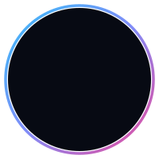

  

<table border="0" width="100%" cellpadding="0" cellspacing="0">
  <tr>
    <td width="75%" valign="top">
       
      
       
      
I build full-stack web architectures and scale e-commerce systems with 11+ years of experience delivering robust business platforms for international clients. Currently pursuing <b>BSc (Hons) Computing at Coventry University (UK)</b> and working as an <b>Associate Software Engineer</b>.

      
📍 Colombo, Sri Lanka · 🎓 NIBM / Coventry University

    </td>
    <td width="25%" align="center" valign="middle">
      
    </td>
  </tr>
</table>

  
  
  
  

---

### 🚀 About Me

I specialize in architectural design and full-stack development, delivering robust digital products that drive commercial value.

*   💻 **Full-stack:** Next.js, Node.js, PHP, MySQL, PostgreSQL
*   ☁️ **Deployment:** VPS, Vercel, CI/CD pipelines
*   🧠 **Focus:** SaaS, eCommerce, LMS, automation systems
*   ⚡ **Execution:** I turn ideas into production-ready systems

> 💡 *I don’t build “projects”. I build systems that solve real problems.*

---

### 💼 Professional Experience

*   **Associate Software Engineer** @ *Regulus Compliance Solutions PVT LTD* (May 2026 - Present)
    *   Full-stack development, compliance systems, database tuning, and Agile execution.
*   **E-commerce Store Manager** @ *Mija SVK s.r.o (Slovakia)* (Mar 2025 - Present)
    *   Freelance remote manager for international 3D printing & POD marketplaces (Etsy, eBay, Shopify).
*   **Founder & Managing Director** @ *ANUSHKA DAHANAYAKE (PVT) LTD* (Jun 2024 - Present)
    *   IT consultancy, custom WordPress/WooCommerce, and full-stack software business solutions.
*   **Assistant Web Developer** @ *Golden Island Hospitality (Pvt) Ltd* (Jan 2026 - May 2026)
    *   Maintained online transactional web applications and operational software in Colombo.
*   **Freelance Developer & Consultant** @ *Fiverr / ADDMPS* (2018 - Present)
    *   Delivered e-commerce setups, dropshipping pipelines, payment gateway integrations, and SEO strategies.

---

### 🛠 Tech & Skills Directory

| Category | Technologies & Tools |
| :--- | :--- |
| **Frontend & UI/UX** |      |
| **Backend & APIs** |     |
| **E-Commerce & SEO** |     |
| **Databases** |   |
| **Payments** |    |
| **DevOps & Tools** |     |

---

### 📌 Academic & Professional Projects

<table width="100%">
  <tr>
    <td width="50%" valign="top">
      <h4>🧠 Learning Management System (LMS)</h4>
      
Modular LMS application designed for student tracking and course content uploading.

      <ul>
        <li>Java Spring Boot architecture</li>
        <li>Secure MySQL database layout</li>
        <li>Document management REST APIs</li>
      </ul>
    </td>
    <td width="50%" valign="top">
      <h4>🚌 Bus Ticket Booking App</h4>
      
Bespoke web-based transit booking pipeline and seat-allocation validation engine.

      <ul>
        <li>Developed in PHP, HTML, and CSS</li>
        <li>Relational database mapping in MySQL</li>
        <li>Automated ticket scoring and locking scripts</li>
      </ul>
    </td>
  </tr>
  <tr>
    <td width="50%" valign="top">
      <h4>⚙️ Restaurant Microservices App</h4>
      
Decoupled food ordering pipeline implementing cloud microservice architectures.

      <ul>
        <li>Built with Java &amp; Spring Cloud</li>
        <li>Designed for horizontal scalability</li>
        <li>Service discovery and circuit breaker patterns</li>
      </ul>
    </td>
    <td width="50%" valign="top">
      <h4>📦 Delivery Planner Tool</h4>
      
A smart route scheduler executing advanced algorithms and optimal pathing calculations.

      <ul>
        <li>Constructed in Java using OOP design</li>
        <li>Advanced Programming, Data Structures, and Algorithms (PDSA)</li>
        <li>Optimized scheduling routing matrix</li>
      </ul>
    </td>
  </tr>
</table>

---

### 🎓 Education

*   **BSc (Hons) Computing (4th Year)** | *Coventry University (UK) – NIBM Colombo* (2025 - Expected Mar 2027)
    *   *Modules:* User Experience Designing, Web API Development, Computer Vision, AI, Cyber Security, Agile Methodologies, and Dissertation Project (Management Web Application).
*   **HND & Diploma in Software Engineering** | *NIBM, Colombo* (2023 - 2025)
    *   *Focus:* OOP, Data Structures, Relational Database Design, and Software Architectures.
*   **Secondary Education** | *Maliyadeva College, Kurunegala* (2006 - 2019)

---

### 📊 GitHub Stats

  <table border="0">
    <tr>
      <td>
        
      </td>
      <td>
        
      </td>
    </tr>
  </table>

---

### 📫 Let's Connect

*   💼 **LinkedIn:** [Anushka Dahanayake](https://linkedin.com/in/anushkadahanayake)
*   🌐 **Website:** [anushkadahanayake.com](https://anushkadahanayake.com)
*   💼 **Portfolio:** [anushkadahanayake.com/portfolio](https://anushkadahanayake.com/portfolio)
*   ✉️ **Email:** [anushkadahanayake1@gmail.com](mailto:anushkadahanayake1@gmail.com)

---

  <i>Build less. Think deeper. Ship systems that scale. 🚀</i>

