  

  

---

### 🚀 About Me

I build full-stack web systems with a focus on performance, scalability, and real business value.

*   💻 **Full-stack:** Next.js, Node.js, PHP, MySQL, PostgreSQL
*   ☁️ **Deployment:** VPS, Vercel, CI/CD pipelines
*   🧠 **Focus:** SaaS, eCommerce, LMS, automation systems
*   🌍 **Experience:** Working with international clients (EU & Asia)
*   ⚡ **Execution:** I turn ideas into production-ready systems

> 💡 *I don’t build “projects”. I build systems that solve real problems.*

---

### 🛠 Tech Stack

| Category | Technologies |
| :--- | :--- |
| **Frontend** |     |
| **Backend** |    |
| **Database** |   |
| **DevOps** |     |

---

### 🧱 What I Build

*   🛒 **E-commerce platforms** — Custom-designed product flows, checkout funnels, and WooCommerce/Shopify solutions.
*   🎓 **LMS systems** — Enterprise learning systems featuring multi-department logic, interactive quizzes, and automated certificate generation.
*   📊 **Admin Dashboards & Analytics** — Secure back-offices and data tracking panels built for clarity and speed.
*   ⚙️ **API-Driven Backends** — Scalable microservices and API integrations to automate cross-platform tasks.
*   🚀 **High-Conversion Landing Pages** — Webpages fully optimized for speed, performance, and SEO.

---

### 📌 Featured Projects

<table width="100%">
  <tr>
    <td width="50%" valign="top">
      <h4>🧠 LMS Platform (Enterprise System)</h4>
      
Multi-department learning system with custom quizzes, exams, and automated certificate generation.

      <ul>
        <li>Role-based access control (RBAC)</li>
        <li>Custom exam engine + dynamic scoring logic</li>
        <li>Automated PDF certificate delivery</li>
      </ul>
    </td>
    <td width="50%" valign="top">
      <h4>🚌 Bus Booking System</h4>
      
Real-time seat reservation platform equipped with a centralized administrative control dashboard.

      <ul>
        <li>Concurrent seat-locking algorithm</li>
        <li>Dynamic booking flows</li>
        <li>Real-time revenue tracking and scheduling</li>
      </ul>
    </td>
  </tr>
  <tr>
    <td colspan="2" valign="top">
      <h4>🛒 E-commerce Store (AXMRT / Elecsto)</h4>
      
Custom-built production checkout system designed for lightning-fast speeds and high SEO visibility.

      <ul>
        <li>Complex inventory and product management APIs</li>
        <li>Optimized multi-currency checkout gateways</li>
        <li>Highly responsive, search-engine-friendly user interface</li>
      </ul>
    </td>
  </tr>
</table>

---

### 📊 GitHub Stats

  <table border="0">
    <tr>
      <td>
        
      </td>
      <td>
        
      </td>
    </tr>
  </table>

---

### 📫 Let's Connect

*   💼 **LinkedIn:** [Anushka Dahanayake](https://linkedin.com/in/yourprofile) <!-- Replace with actual LinkedIn handle -->
*   🌐 **Portfolio:** [yourdomain.com](https://yourdomain.com) <!-- Replace with actual portfolio URL -->
*   ✉️ **Email:** [yourmail@example.com](mailto:yourmail@example.com)

---

  <i>Build less. Think deeper. Ship systems that scale. 🚀</i>

